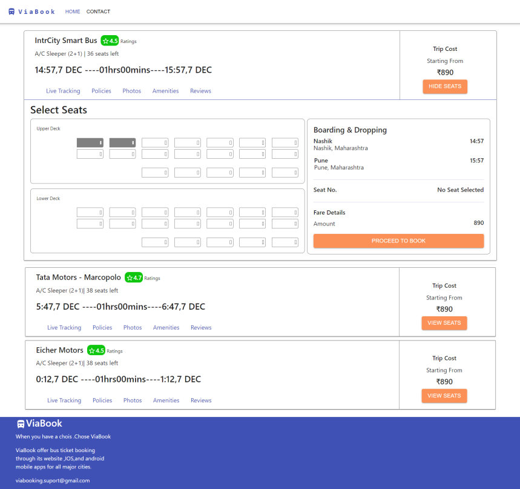

# ViaBook - Seamless Bus Booking Web Application

## Introduction

Welcome to ViaBook, your go-to solution for hassle-free and efficient bus ticket booking! ViaBook is a dynamic web application that I proudly developed using the MERN (MongoDB, Express.js, React, Node.js) stack technology. This innovative platform is designed to revolutionize the way users book bus tickets, offering a seamless and user-friendly online experience.

Checkout web-app demo here - [ViaBook](https://resonant-macaron-2d2bb4.netlify.app/)

## Table of Contents

- [Introduction](#introduction)
- [Screenshot](#screenshot)
- [Technologies](#technologies)
- [Features](#features)
- [Getting Started](#getting-started)
- [Prerequisites](#prerequisites)
- [Installation](#installation)
- [Usage](#usage)
- [Contributing](#contributing)
- [License](#license)
- [Acknowledgements](#acknowledgements)

## Screenshot





## Technologies

- MongoDB for database
- React for frontend
- Redux for frontend
- Express.js node js framework
- Node.js for backend

## Features

### 1. Effortless Ticket Search

- Search for bus tickets easily by specifying the origin and destination.
- Select a specific travel date to view available buses.

### 2. Diverse Bus Options

- Explore a wide range of bus options from various operators.
- View detailed information about each bus, including amenities and available seat classes.

### 3. Intuitive Seat Selection

- Choose your preferred seat from an interactive seat map.
- Visualize the bus layout and select seats that suit your preferences.

### 4. Secure Online Payments

- Make secure online payments using popular payment methods.
- Enjoy a hassle-free payment experience with advanced security measures.

### 5. Real-time Seat Blocking

- Block your chosen seat upon payment to ensure availability.
- Get immediate confirmation of your reserved seat.

### 6. Booking Confirmation Email

- Receive a booking confirmation email with details of your reservation.
- Have your ticket information readily available for your journey.

### 7. User-Friendly Interface

- Navigate the application effortlessly with an intuitive and user-friendly interface.
- Enjoy a seamless booking experience from start to finish.

### 8. Responsive Design

- Access ViaBook on various devices, including desktops, tablets, and mobile phones.
- Experience a consistent and responsive design for optimal usability.

## Getting Started

### Prerequisites

Before running the project, make sure you have the following prerequisites installed on your system:

- Node.js and npm: Install from [https://nodejs.org/](https://nodejs.org/)

## Installation

1. Clone the repository:

   ```bash
   git clone https://github.com/unkitsingh0/Trips
    cd your-project
    cd client
    npm install
    cd ..
    cd server
    npm install
   ```

2. Set up the MongoDB connection:

   - Ensure you have MongoDB installed and running on your system.
   - Create a MongoDB database for the Viabook(Bus booking app) project and note down the connection string.

3. Configure the application:

   - Create a `.env` file in the root directory of the project.
   - Add the following environment variables to the `.env` file:

   ```
   PORT=8080                  # The port on which the application will run
   MONGODB_URI=your_mongodb_uri_here  # The MongoDB connection string
   ```

### Usage

1. Start the server:

   ```bash
   npm start

   ```

2. Open your web browser and point it to the ViaBook application at `http://localhost:3000`.

3. Immerse yourself in the exciting world of travel as you explore a captivating array of available bus routes. Easily find the perfect journey from your desired origin to destination.

4. Your journey is about to become even more exciting! Dive into the seat selection experience with an interactive seat map. Visualize the bus layout and choose seats that perfectly suit your preferences.

5. Just like setting the stage for a great movie, now it's time to set the stage for your journey. Explore showtime details for each bus, including departure times and bus amenities. Find the perfect bus style for your travel comfort.

6. With your seats reserved, you're just a few steps away from a seamless journey. Follow the prompts to complete the booking process effortlessly. Provide the required information, and you're ready for your bus adventure!

### Contributing

We embrace contributions from our community of enthusiasts! If you're eager to contribute to our project, we'd appreciate it greatly. Just adhere to these guidelines:

```markdown
## Contributing

- Fork the repository.
- Create a new branch for your feature/bug fix.
- Make your changes and test thoroughly.
- Create a pull request with a clear description of your changes.
```

## Contributions

This project was conceived, designed, and implemented by Ankit Singh. As the sole author and developer, I have crafted every aspect of this project, from inception to completion.

While this project was created independently, I appreciate your interest and encourage you to explore and use it. If you have any questions, feedback, or suggestions, please feel free to reach out.

Thank you for checking out my work!

## License

This project is open source and is available under the [MIT License](LICENSE). The MIT License is a permissive open-source license that allows you to use, modify, and distribute this software for free, provided you include the original copyright notice and disclaimers.
For more details, please read the [LICENSE](LICENSE) file.

## Acknowledgements

This project makes use of several open-source libraries and packages to enhance its functionality:

1. Frontend dependency or package

- **React** (version 18.2.0): A declarative, efficient, and flexible JavaScript library for building user interfaces.

- **React Router Dom** (version 6.20.0): A popular library for routing in React applications.

- **Redux** (version 4.2.1): A predictable state container for JavaScript applications.

- **React Redux** (version 8.1.3): Official React bindings for Redux.

- **Redux Thunk** (version 2.4.2): Middleware for Redux that allows you to write action creators that return a function instead of an action.

- **Styled Components** (version 6.1.1): A CSS-in-JS library for styling React components.

- **Emotion** (versions 11.11.1 and 11.11.0): A popular library for writing styles with JavaScript.

- **MUI (Material-UI)** (versions 5.14.18, 5.0.0-alpha.153, and 6.0.0-alpha.6): A React UI framework with a set of high-quality components.

- **Bootstrap** (version 5.3.2): A front-end component library for building responsive and mobile-first websites.

- **React Date Pickers** (version 6.18.2): A set of accessible date pickers for React.

- **Day.js** (version 1.11.10): A minimalist JavaScript library for parsing, validating, manipulating, and formatting dates.

- **Stripe JS** (version 2.2.0): A JavaScript library for Stripe elements and Stripe.js.

- **React Loader Spinner** (version 5.4.5): A lightweight and customizable loader component for React.

- **React Hot Toast** (version 2.4.1): A minimalistic toast library for React applications.

- **Testing Library** (versions 5.17.0, 13.4.0, and 13.5.0): A set of utilities for testing React components.

- **Web Vitals** (version 2.1.4): A library for measuring web performance metrics.

- **react-toastify** - A library for displaying notifications and toasts in your application.

2. Backend dependency or package

- **Express** (version 4.18.2): A fast, unopinionated, minimalist web framework for Node.js.

- **MongoDB** (version 6.2.0): A popular NoSQL database for scalable and flexible data storage.

- **Cors** (version 2.8.5): A middleware for handling Cross-Origin Resource Sharing (CORS) in Express applications.

- **Dotenv** (version 16.3.1): A zero-dependency module that loads environment variables from a `.env` file into `process.env`.

- **Nodemailer** (version 6.9.7): A module for sending emails from Node.js applications.

- **Stripe** (version 14.5.0): A JavaScript library for interfacing with the Stripe API, facilitating secure online payments.

These libraries and packages have played an integral role in the development of this project. We extend our gratitude to their creators and maintainers for their valuable contributions to the open-source community, enabling us to build robust and efficient Node.js applications.

---

You're most welcome to ViaBook! Should you have any inquiries or require additional support, please don't hesitate to get in touch with us or raise an issue within the repository. We're here to ensure your Bus booking experience is nothing short of delightful! Enjoy your journey!
